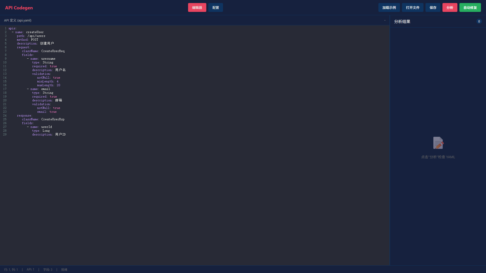

# API Codegen

基于 YAML 定义自动生成 Java API 代码，支持 CXF (JAX-RS) 框架。

## 环境要求

- **JDK 21** 或更高版本

## 四种使用方式

### 方式一：Web UI 可视化界面（推荐新手）

**适合：** 不想记命令，想可视化编辑 YAML、实时预览、自动修复

```bash
# 启动本地服务
cd web-ui
python -m http.server 8080
# 然后浏览器打开 http://localhost:8080
```

或直接用浏览器打开 `web-ui/index.html`

### 方式二：Java 直接运行（推荐，无需 Maven）

**适合：** 没有 Maven 环境，或内网无法下载依赖

```bash
# 克隆并进入项目目录
git clone https://github.com/Emtemf/api-codegen.git
cd api-codegen

# 构建（需要 JDK 21）
.\mvnw.cmd clean package -DskipTests

# 运行
java -jar api-codegen-core/target/api-codegen.jar api.yaml

# 带参数运行
java -jar api-codegen-core/target/api-codegen.jar api.yaml -output=src/main/java -package=com.example
```

### 方式三：Maven Wrapper（推荐，无需安装 Maven）

**适合：** 有 JDK 21，但不想安装 Maven

```bash
# 克隆并进入项目目录
git clone https://github.com/Emtemf/api-codegen.git
cd api-codegen

# 构建
.\mvnw.cmd clean package -DskipTests

# 运行插件
.\mvnw.cmd api-codegen:generate -DyamlFile=api.yaml
```

### 方式四：Maven 插件（适合项目集成）

**适合：** 在现有 Maven 项目中集成使用

**1. 添加插件到你的 `pom.xml`：**

```xml
<build>
    <plugins>
        <plugin>
            <groupId>com.apicgen</groupId>
            <artifactId>api-codegen-maven-plugin</artifactId>
            <version>1.0.0</version>
            <configuration>
                <yamlFile>${basedir}/src/main/resources/api.yaml</yamlFile>
                <basePackage>com.example.api</basePackage>
            </configuration>
        </plugin>
    </plugins>
</build>
```

**2. 运行生成：**

```bash
# 基本生成
mvn com.apicgen:api-codegen-maven-plugin:generate

# 或使用短命令（首次需要完整 groupId）
mvn api-codegen:generate

# 强制覆盖已有文件
mvn api-codegen:generate -Dforce=true

# 分析校验规则
mvn api-codegen:generate -Danalyze=true

# 自动修复校验规则
mvn api-codegen:generate -DautoFix=true

# 带自定义参数
mvn api-codegen:generate -DyamlFile=src/main/resources/api.yaml -DbasePackage=com.example.api
```

---

## IntelliJ IDEA 中使用

### 在 IDEA 中使用 Maven 插件

**方法 1：使用 Maven 面板**

1. 打开 IDEA，点击右侧 **Maven** 面板
2. 展开 **api-codegen** > **Lifecycle**
3. 双击 **package**（跳过测试可勾选 Skip Tests）

**方法 2：使用 Terminal**

1. 点击底部 **Terminal**
2. 运行：
   ```
   .\mvnw.cmd clean package -DskipTests
   ```

**方法 3：直接运行插件目标**

1. Maven 面板中展开 **api-codegen** > **Plugins** > **api-codegen**
2. 双击 **api-codegen:generate**

或在 Terminal 运行：
```
.\mvnw.cmd api-codegen:generate -DyamlFile=你的api.yaml
```

---

## 验证结果

| 方式 | 命令 | 状态 | 环境 | 备注 |
|------|------|------|------|------|
| Java jar | `java -jar api-codegen.jar api.yaml` | ✅ 通过 | Windows + JDK 21 | 生成 16 个文件 |
| Maven Wrapper | `.\mvnw.cmd api-codegen:generate` | ✅ 通过 | Windows + JDK 21 | 生成 16 个文件 |
| Maven 插件 | `mvn api-codegen:generate` | ✅ 通过 | Windows + JDK 21 + Maven | 生成 16 个文件 |
| analyze 校验分析 | `java -jar api-codegen.jar api.yaml --analyze` | ✅ 通过 | Windows + JDK 21 | 检测 23 个问题 |
| auto-fix 自动修复 | `java -jar api-codegen.jar api.yaml --auto-fix` | ✅ 通过 | Windows + JDK 21 | 修复 23 个问题 |
| Maven analyze | `mvn api-codegen:generate -Danalyze=true` | ✅ 通过 | Windows + JDK 21 | 检测 23 个问题 |
| Maven auto-fix | `mvn api-codegen:generate -DautoFix=true` | ✅ 通过 | Windows + JDK 21 | 修复 23 个问题 |

---

## API 定义示例

创建 `api.yaml` 文件，支持两种格式：

### 格式一：自定义格式（推荐）

```yaml
apis:
  - name: createUser
    path: /api/users
    method: POST
    description: 创建用户
    request:
      className: CreateUserReq
      fields:
        - name: username
          type: String
          required: true
          description: 用户名
          validation:
            minLength: 4
            maxLength: 20
        - name: email
          type: String
          required: true
          description: 邮箱
          validation:
            email: true
    response:
      className: CreateUserRsp
      fields:
        - name: userId
          type: Long
          description: 用户ID
```

### 格式二：Swagger 2.0 / OpenAPI 3.0（自动转换）

直接导入 Swagger 或 OpenAPI 格式的 YAML：

```yaml
swagger: '2.0'
info:
  version: v1
  title: 用户管理 API
  description: 用户相关的 API 接口
schemes:
  - https
basePath: /api
paths:
  /users:
    get:
      summary: 获取用户列表
      operationId: getUserList
      responses:
        200:
          description: 成功
          schema:
            type: array
            items:
              $ref: '#/definitions/User'
    post:
      summary: 创建用户
      operationId: createUser
      parameters:
        - name: body
          in: body
          required: true
          schema:
            $ref: '#/definitions/CreateUserRequest'
      responses:
        200:
          description: 成功
definitions:
  User:
    type: object
    properties:
      id:
        type: integer
        description: 用户ID
      username:
        type: string
        description: 用户名
```

**提示：** 系统会自动检测 YAML 格式，无需手动指定。

## 统一 API 控制器

从 v1.1.0 开始，系统生成**统一的 API 控制器**，一个 YAML 文件对应一个 Controller 类：

```java
// 根据 basePackage 生成类名，如 com.example.api -> ExampleApi
@Path("/api")
public class ExampleApi {

    @POST
    @Path("/users")  // /api/users
    public CreateUserRsp create(@Valid CreateUserReq req) {
        // TODO: 实现业务逻辑
        return null;
    }

    @GET
    @Path("/users/{id}")  // /api/users/{id}
    public GetUserRsp query(@PathParam("id") Long id) {
        // TODO: 实现业务逻辑
        return null;
    }
}
```

## 自定义注解配置

支持在 `codegen-config.yaml` 中配置自定义注解（适用于框架定制化需求）：

```yaml
# 自定义注解配置
customAnnotations:
  # 类级别注解（应用于 Controller 类）
  classAnnotations:
    - "@Secured"
    - "@AuditLog"

  # 方法级别注解（应用于每个方法）
  methodAnnotations:
    - "@Permission(\"default\")"
```

**生成效果：**

```java
@Path("/api")
@Secured
@AuditLog
public class ExampleApi {

    @Permission("default")
    @POST
    @Path("/users")
    public CreateUserRsp create(@Valid CreateUserReq req) {
        // ...
    }
}
```

## 输出文件

```
generated/api/          # Controller - 统一 API 控制器
src/main/java/req/      # Request - 自动覆盖
src/main/java/rsp/      # Response - 自动覆盖
```

## 配置文件 (`codegen-config.yaml`)

```yaml
# 框架类型: cxf
framework: CXF

# 版权配置
copyright:
  company: ""            # 公司名称（为空时省略版权声明）
  startYear: 2024

# OpenAPI 配置
openApi:
  enabled: false
  version: "3.0"

# 自定义注解配置（适用于框架定制化）
customAnnotations:
  # 类级别注解（应用于 Controller 类）
  classAnnotations:
    - "@Secured"

  # 方法级别注解（应用于每个方法）
  methodAnnotations:
    - "@Permission(\"default\")"

# 输出配置
output:
  controller:
    path: generated/api/    # Controller 生成位置（手动复制）
  request:
    path: src/main/java/req/  # Request 自动覆盖位置
  response:
    path: src/main/java/rsp/  # Response 自动覆盖位置
```

## 命令行参数（方式一）

```bash
java -jar api-codegen.jar <yaml文件> [选项]

选项:
  -output, --outputDir <目录>     输出目录 (默认: ./generated)
  -package, --basePackage <包名>  基础包名 (默认: com.apicgen)
  -company <公司名>               版权公司名
  -framework <框架>              框架类型: cxf (默认: cxf)
  -force                         强制覆盖已有文件
  -analyze, --analyze            分析缺失的校验规则
  -auto-fix, --auto-fix          自动补全缺失的校验规则
  -help, --help                  显示帮助信息
```

## 校验分析功能

校验分析功能可以自动检测 YAML 文件中的 API 定义，识别缺少校验规则的字段，并提供详细的分析报告。

### 分析缺失的校验规则

自动检测 YAML 中字段是否缺少校验规则：

```bash
# 分析 YAML 文件中的校验问题
java -jar api-codegen.jar api.yaml --analyze
```

**使用 Maven 插件：**
```bash
mvn api-codegen:generate -Danalyze=true
```

### 校验报告示例

运行分析命令后，会生成详细的校验报告：

```
================================================================================
                        API Validation Analysis Report
================================================================================
File: validation-demo.yaml
Date: 2024-XX-XX XX:XX:XX
--------------------------------------------------------------------------------

SUMMARY
================================================================================
Total APIs:          3
Total Fields:        25
  - With Validation:  9 (36%)
  - Missing:         16 (64%)

ISSUES BY SEVERITY
================================================================================
  [ERROR]   7  (Critical - required fields missing @NotNull/@NotBlank)
  [WARN]   15  (Warning  - recommended validations missing)
  [INFO]    0

TOTAL ISSUES: 22

================================================================================
                           DETAILED ISSUES
================================================================================

[ISSUE #1] CreateUserSimpleReq.username (String, required)
--------------------------------------------------------------------------------
  Severity: ERROR
  Problem:  必填字段缺少 @NotNull/@NotBlank 校验
  Fix:      Add validation:
              - notNull: true

[ISSUE #2] CreateUserSimpleReq.email (String, required)
--------------------------------------------------------------------------------
  Severity: ERROR
  Problem:  必填字段缺少 @NotNull/@NotBlank 校验
  Fix:      Add validation:
              - notNull: true

[ISSUE #3] CreateUserSimpleReq.email (String)
--------------------------------------------------------------------------------
  Severity: WARN
  Problem:  邮箱字段建议添加邮箱格式校验
  Fix:      Add validation:
              - email: true

[ISSUE #4] CreateUserSimpleReq.userPhone (String)
--------------------------------------------------------------------------------
  Severity: WARN
  Problem:  电话字段建议添加手机号正则校验
  Fix:      Add validation:
              - pattern: "^1[3-9]\\d{9}$"

[ISSUE #5] CreateUserSimpleReq.username (String)
--------------------------------------------------------------------------------
  Severity: WARN
  Problem:  String 字段缺少长度校验
  Fix:      Add validation:
              - minLength: 1
              - maxLength: 255

[ISSUE #6] CreateUserSimpleReq.age (Integer)
--------------------------------------------------------------------------------
  Severity: WARN
  Problem:  数值字段缺少范围校验
  Fix:      Add validation:
              - min: 0
              - max: 2147483647

[ISSUE #7] CreateUserSimpleReq.balance (Double)
--------------------------------------------------------------------------------
  Severity: WARN
  Problem:  数值字段缺少范围校验
  Fix:      Add validation:
              - min: 0.0
              - max: 9999999999.0

[ISSUE #8] CreateUserSimpleReq.items (List<String>)
--------------------------------------------------------------------------------
  Severity: WARN
  Problem:  List 字段缺少大小范围校验
  Fix:      Add validation:
              - minSize: 1
              - maxSize: 100

[ISSUE #9] CreateUserSimpleReq.orderIds (List<Long>)
--------------------------------------------------------------------------------
  Severity: WARN
  Problem:  List 字段缺少大小范围校验
  Fix:      Add validation:
              - minSize: 0
              - maxSize: 100

[ISSUE #10] CreateUserSimpleReq.dob (LocalDate)
--------------------------------------------------------------------------------
  Severity: WARN
  Problem:  生日/日期字段建议添加过去日期校验
  Fix:      Add validation:
              - past: true

[ISSUE #11] CreateUserSimpleReq.scheduleDate (LocalDateTime)
--------------------------------------------------------------------------------
  Severity: WARN
  Problem:  预约/未来日期字段建议添加未来日期校验
  Fix:      Add validation:
              - future: true

[ISSUE #12] UpdateUserReq.profile.avatar (String)
--------------------------------------------------------------------------------
  Severity: WARN
  Problem:  String 字段缺少长度校验
  Fix:      Add validation:
              - minLength: 1
              - maxLength: 255

--------------------------------------------------------------------------------

SUGGESTED FIX
================================================================================
Run with --auto-fix to automatically apply these fixes:
  java -jar api-codegen.jar validation-demo.yaml --auto-fix

================================================================================
```

### 报告说明

| 字段 | 说明 |
|------|------|
| **Total APIs** | YAML 文件中的 API 数量 |
| **Total Fields** | 所有 API 的字段总数（包含嵌套对象字段） |
| **With Validation** | 已有校验规则的字段数 |
| **Missing** | 缺少校验规则的字段数 |
| **ERROR** | 严重问题（必填字段缺少 @NotNull 校验） |
| **WARN** | 警告（建议添加的校验规则） |
| **INFO** | 信息性提示 |

### 问题等级说明

#### ERROR（错误）- 必须修复

| 场景 | 说明 |
|------|------|
| 必填字段缺少校验 | `required: true` 的字段没有 `validation.notNull: true` |

#### WARN（警告）- 建议修复

| 字段类型 | 建议校验规则 |
|----------|-------------|
| `String` | `minLength: 1`, `maxLength: 255` |
| `Integer/Long` | `min: 0`, `max: 2147483647` |
| `Double` | `min: 0.0`, `max: 9999999999.0` |
| `List<T>` | `minSize: 1`, `maxSize: 100` |
| 邮箱字段 | `email: true` |
| 电话字段 | `pattern: "^1[3-9]\\d{9}$"` |
| 生日字段 | `past: true` |
| 预约字段 | `future: true` |

### 智能字段识别

系统会自动识别以下字段类型并推荐相应校验规则：

| 识别规则 | 字段名包含 | 自动添加校验 |
|---------|-----------|-------------|
| 邮箱字段 | `email`, `mail` | `email: true` |
| 电话字段 | `phone`, `tel`, `mobile` | `pattern: "^1[3-9]\\d{9}$"` |
| 生日字段 | `birth`, `dob`, `birthday` | `past: true` |
| 预约字段 | `appointment`, `schedule`, `future` | `future: true` |
| 年龄字段 | `age` | `min: 0`, `max: 150` |
| 余额字段 | `balance`, `amount`, `price` | `min: 0.0` |

### 演示文件

项目提供了完整的校验分析演示文件，位于：

```
api-codegen-core/src/test/resources/yaml/validation-demo.yaml
```

该文件包含三种典型场景：

1. **createUserComplete** - 完整校验的 API（无问题）
2. **createUserSimple** - 缺少校验的 API（有 22 个问题）
3. **updateUser** - 混合场景（部分字段有校验，部分缺失）

运行分析命令查看效果：

```bash
java -jar api-codegen-core/target/api-codegen.jar api-codegen-core/src/test/resources/yaml/validation-demo.yaml --analyze
```

### 自动修复校验规则

根据分析结果自动补全校验规则：

```bash
# 自动修复 YAML 文件
java -jar api-codegen.jar api.yaml --auto-fix
```

**自动修复规则：**

| 类型 | 默认规则 |
|------|----------|
| String | `minLength: 1`, `maxLength: 255` |
| Integer/Long | `min: 0`, `max: 2147483647` |
| Double | `min: 0`, `max: 9999999999` |
| List | `minSize: 1`, `maxSize: 100` |
| 邮箱字段 | 自动添加 `email: true` |
| 电话字段 | 自动添加正则 `^1[3-9]\\d{9}$` |
| 生日字段 | 自动添加 `past: true` |
| 预约字段 | 自动添加 `future: true` |

### Maven 插件中使用

```bash
# 分析校验规则
mvn api-codegen:generate -Danalyze=true

# 自动修复校验规则
mvn api-codegen:generate -DautoFix=true
```

## 支持的数据类型

| 类型 | 说明 |
|------|------|
| `String` | 字符串 |
| `Integer` | 整数 |
| `Long` | 长整数 |
| `Double` | 浮点数 |
| `Boolean` | 布尔值 |
| `LocalDate` | 日期 |
| `LocalDateTime` | 日期时间 |
| `List<T>` | 列表 |
| `Enum` | 枚举 |
| `自定义对象` | 嵌套对象 |

## 单元测试

项目包含 **94 个单元测试**，使用 JUnit 5 + BDD 风格：

```bash
# 运行所有测试
mvn test

# 运行特定测试类
mvn test -Dtest=ApiValidatorTest

# 运行测试并查看详细报告
mvn test -Dsurefire.useFile=false
```

### 测试覆盖

| 模块 | 测试类 | 用例数 | 说明 |
|------|--------|--------|------|
| 校验器 | `ApiValidatorTest` | 70+ | DFX 规则、边界值、错误检测 |
| 解析器 | `YamlParserTest` | 10+ | YAML 解析、错误处理 |
| 代码生成 | `CodeGeneratorTest` | 5+ | Controller、Req、Rsp 生成 |
| Maven 插件 | `ApiCodegenMojoTest` | 2 | 插件集成 |
| 工具类 | `CodeGenUtilTest` | 5+ | 工具方法 |
| Main | `MainTest` | 2 | 独立运行入口 |

### 测试风格（BDD）

```java
/**
 * 测试场景：minLength大于maxLength
 * 预期结果：minLength不能大于maxLength，校验失败
 * 实际结果：ValidationResult.isValid()返回false
 */
@Test
@DisplayName("should_fail_when_minLength_greater_than_maxLength")
void shouldFailWhenMinLengthGreaterThanMaxLength() {
    // Given
    String yamlContent = "...";
    ApiDefinition apiDefinition = YamlParser.parse(yamlContent);

    // When
    ValidationResult result = validator.validate(apiDefinition);

    // Then
    assertFalse(result.isValid());
}
```

---

## Web UI（可视化界面）

API Codegen 提供 Web 界面，可视化编辑 API 定义、校验分析、自动修复、代码预览。

### 快速开始

```bash
# 方式一：直接用浏览器打开
# 在浏览器中打开 web-ui/index.html 文件即可

# 方式二：本地 HTTP 服务（推荐，支持热更新）
cd web-ui
# 使用 Python
python -m http.server 8080
# 或使用 Node.js
npx http-server -p 8080
```

然后访问 http://localhost:8080

### Web UI 功能

| 功能 | 说明 |
|------|------|
| **YAML 编辑器** | 语法高亮、自动补全、实时校验 |
| **配置编辑器** | 编辑 codegen-config.yaml |
| **校验分析** | 自动检测缺失的校验规则 |
| **自动修复** | 一键补全校验规则 |
| **代码预览** | 预览生成的 Controller、Req、Rsp 代码 |
| **文件操作** | 加载示例、打开本地文件、保存 |

### 界面预览



*Web UI 主界面 - YAML 编辑器与校验分析面板*


*代码预览 - 查看生成的 Controller、Req、Rsp 代码*

### 运行测试

```bash
cd web-ui
npm install
npm test  # 运行 analyzer 测试
```

### 测试用例展示

测试套件包含 **31 个测试用例**，分为 4 大类：

#### 测试输出示例

```
======================================================================
   API YAML Analyzer - 测试套件
======================================================================

┌─ 分类 1: 错误检测 (YAML 结构)
│
[PASS] #1 空内容应被检测为错误
[PASS] #2 缺少 apis 字段应报错
[PASS] #3 缺少 API 名称应报错
...

┌─ 分类 2: 校验规则 (字段校验)
│
[PASS] #11 必填字段缺少 @NotNull 应报错
[PASS] #12 String 字段无任何校验应警告
...

┌─ 分类 3: 自动修复 (修复前后对比)
│
[PASS] #19 必填字段 → 添加 notNull: true
      修复前: validation: "(无)"
      修复后: validation: {"notNull":true,"minLength":1,"maxLength":255}

[PASS] #20 String 字段 → 添加 minLength/maxLength
      修复前: validation: "(无)"
      修复后: validation: {"minLength":1,"maxLength":255}

[PASS] #21 邮箱字段 → 添加 email: true
      修复前: validation: "(无)"
      修复后: validation: {"minLength":1,"maxLength":255,"email":true}

[PASS] #22 电话字段 → 添加手机号正则
      修复前: validation: "(无)"
      修复后: validation: {"minLength":1,"maxLength":255,"pattern":"^1[3-9]\\d{9}$"}
...

======================================================================
   测试报告
======================================================================

总计: 31 个测试
通过: 31
失败: 0

分类汇总:

  ✓ 错误检测: 10/10 通过
  ✓ 校验规则: 8/8 通过
  ✓ 自动修复: 9/9 通过
  ✓ 边界情况: 4/4 通过
```

#### 测试覆盖

| 分类 | 用例数 | 说明 |
|------|--------|------|
| **错误检测** | 10 | YAML 结构错误、范围冲突检测 |
| **校验规则** | 8 | @NotNull、长度、范围、格式校验建议 |
| **自动修复** | 9 | 修复前后对比展示 |
| **边界情况** | 4 | 多API、嵌套对象、解析错误 |

### 开发调试

```bash
# 启动开发服务器
cd web-ui
npm run serve

# 运行测试
npm test
```

### 离线使用

Web UI 已内置所有依赖，支持离线使用：

```
web-ui/
├── index.html          # 主页面
├── js/
│   └── analyzer.js     # YAML 分析器
└── lib/                # 本地依赖（已下载）
    ├── codemirror.min.js
    ├── yaml.min.js
    └── dracula.min.js
```

---

## IntelliJ IDEA 插件

API Codegen 还提供 IntelliJ IDEA 插件版本，提供图形化界面操作。

### 重要说明

**插件项目已迁移到独立仓库！**

由于 IntelliJ Platform SDK 要求 Java 17，而主项目使用 Java 21，插件已迁移到独立目录：

📁 **插件位置**: [api-codegen-intellij-standalone](../api-codegen-intellij-standalone/)

### 插件功能

- **侧边栏工具窗口**：图形化界面管理 YAML 文件
- **一键分析**：检测缺少的校验规则
- **自动修复**：一键添加校验规则
- **代码生成**：生成 Controller、Request、Response

### 快速开始

1. **克隆插件仓库或进入插件目录：**
   ```
   cd api-codegen-intellij-standalone
   ```

2. **在 IntelliJ IDEA 中打开插件项目：**
   ```
   File > Open > 选择 api-codegen-intellij-standalone/
   ```

3. **配置 SDK：**
   - `File > Project Structure > Project Settings > Project`
   - SDK 选择 `IntelliJ IDEA Community Edition IC-241.0` 或更高版本
   - Language level: Java 17

4. **运行插件：**
   - 找到 `ApiCodegenPlugin.java`
   - 右键选择 `Run Plugin`

### 插件结构

```
api-codegen-intellij-standalone/
├── src/main/java/com/apicgen/intellij/
│   ├── ApiCodegenPlugin.java          # 插件入口
│   ├── ui/
│   │   └── ApiCodegenToolWindowPanel.java  # 主界面
│   ├── toolwindow/
│   │   └── ApiCodegenToolWindowFactory.java # 工具窗口
│   ├── actions/
│   │   ├── AnalyzeAction.java        # 分析动作
│   │   ├── AutoFixAction.java        # 自动修复动作
│   │   ├── GenerateCodeAction.java   # 代码生成动作
│   │   ├── RefreshAction.java        # 刷新动作
│   │   └── ShowToolWindowAction.java # 显示工具窗口动作
│   └── service/
│       ├── ApiCodegenProjectService.java       # 服务接口
│       └── ApiCodegenProjectServiceImpl.java   # 服务实现
├── src/main/resources/
│   └── META-INF/plugin.xml           # 插件配置
└── build.gradle                       # Gradle 构建配置
```

### 依赖说明

插件依赖 `api-codegen-core:1.0.0`，需要先在主项目中安装：

```bash
cd api-codegen
mvn install -DskipTests -pl api-codegen-core
```

---

## License

Apache-2.0
