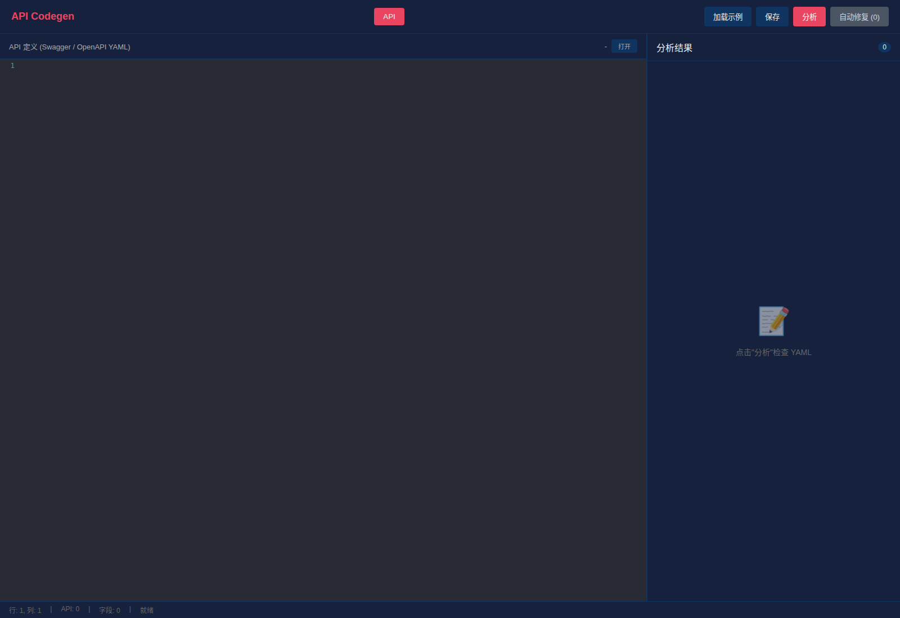
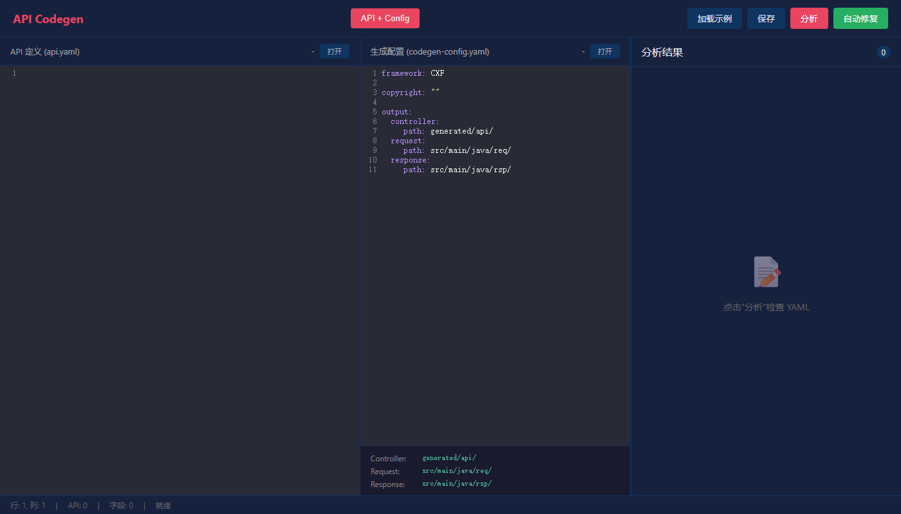
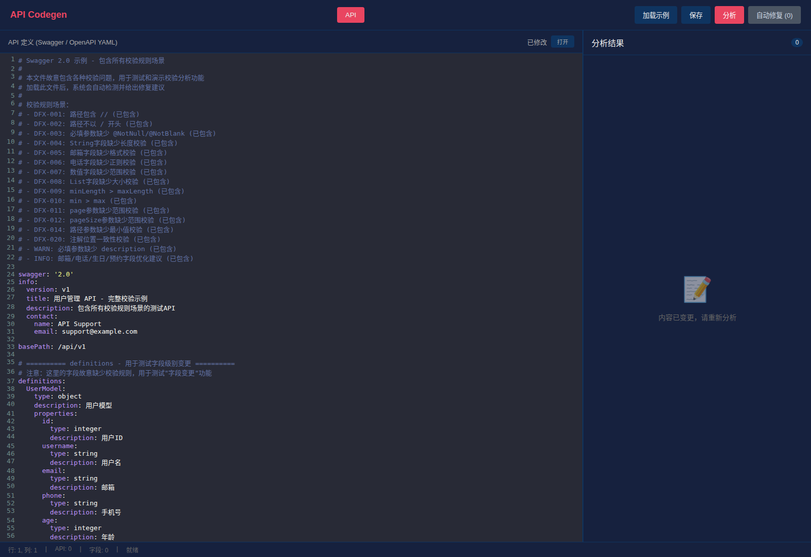
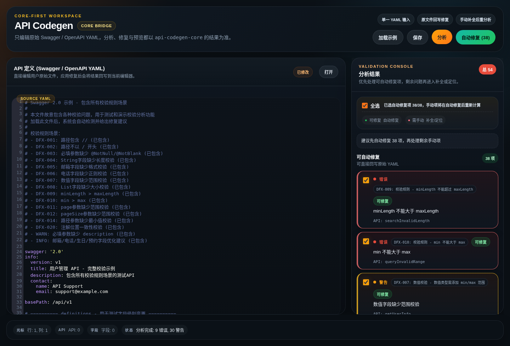
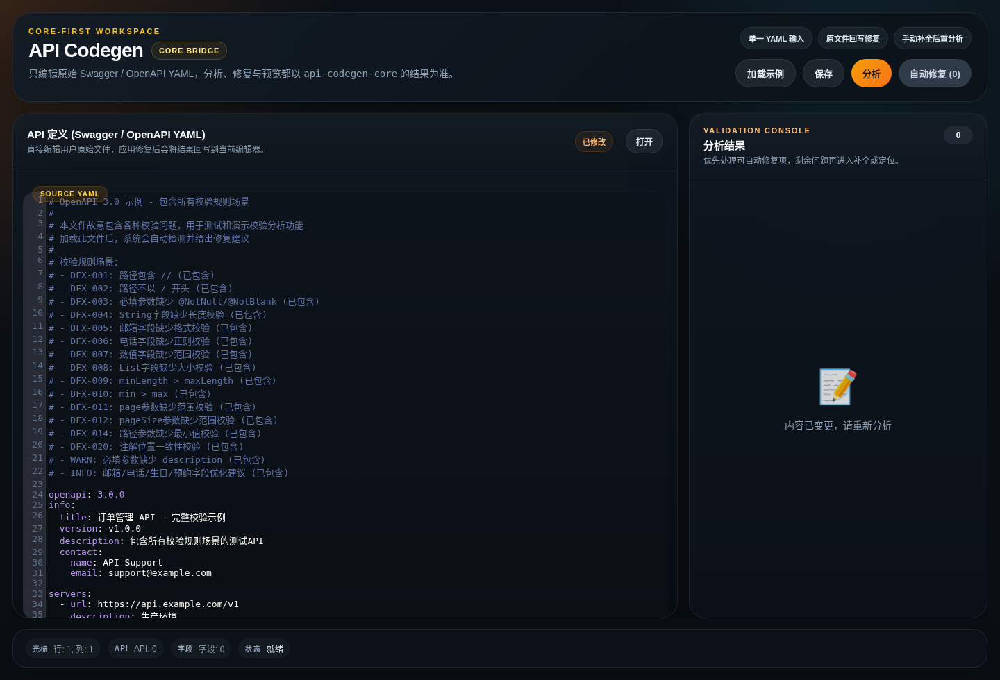

# API Codegen

基于 YAML 定义自动生成 Java API 代码，同时支持 Spring MVC 和 JAX-RS (CXF) 注解。

## 特性

- 支持 **Swagger 2.0** 和 **OpenAPI 3.0** YAML 格式
- 同时生成 Spring MVC 和 JAX-RS (CXF) 注解
- 自动校验分析和修复建议（DFX 规则代码）
- 生成 Controller、Request、Response 类
- 支持类和方法级别自定义注解
- Web UI 可视化编辑，支持实时预览和 Diff 对比
- Maven 插件支持，适配 CI/CD 流程

## 项目结构

```
api-codegen/
├── api-codegen-core/           # 核心代码生成库
├── api-codegen-maven-plugin/  # Maven 插件
└── web-ui/                    # Web 可视化界面
```

## 环境要求

- **JDK 21** 或更高版本（必需）

## 支持的 YAML 格式

| 格式 | 说明 |
|------|------|
| **Swagger 2.0** | 行业标准格式 |
| **OpenAPI 3.0** | 最新行业标准格式 |

系统会自动检测 YAML 格式，无需手动指定。

## 快速开始

### Web UI（推荐）

```bash
cd web-ui
npx serve -l 8080
# 浏览器打开 http://localhost:8080
```

或直接用浏览器打开 `web-ui/index.html`

### Web UI 界面预览

> 注意：如果图片未正常显示，请尝试强制刷新浏览器 (Ctrl+F5)

**1. 初始状态** - 空白编辑器


**2. 点击"加载示例"** - 选择 Swagger 或 OpenAPI 示例


**3. Swagger 示例已加载**


**4. 点击"分析"** - 检测校验问题


**5. OpenAPI 3.0 示例** - 同样支持


### Maven 插件

```bash
mvn com.apicgen:api-codegen-maven-plugin:generate -DyamlFile=api.yaml
```

### Java 直接运行

```bash
# 先构建项目
mvn clean install -DskipTests

# 使用 Maven 执行插件运行
cd api-codegen-core
mvn exec:java -Dexec.mainClass="com.apicgen.Main" -Dexec.args="api.yaml"
```

## 配置文件

在项目根目录创建 `codegen-config.yaml`：

```yaml
# 版权声明（生成代码时添加到文件顶部）
# 例如: Copyright (c) 2024 MyCompany. All rights reserved.
copyright: ""

# OpenAPI 配置
openapi:
  enabled: false
  version: "3.0"

# 自定义注解（可选）
customAnnotations:
  classAnnotations:
    - "@Secured"
    - "@AuditLog"
  methodAnnotations:
    - "@Permission(\"default\")"

# 输出路径配置
output:
  controller:
    path: generated/api/    # Controller 输出目录
  request:
    path: src/main/java/req/  # Request 输出目录
  response:
    path: src/main/java/rsp/  # Response 类出目录
```

### 配置说明

| 配置项 | 说明 |
|--------|------|
| `copyright` | 版权声明，直接放到文件顶部，为空则不添加 |
| `output.controller.path` | 生成的 Controller 类输出路径 |
| `output.request.path` | 生成的 Request 类输出路径 |
| `output.response.path` | 生成的 Response 类输出路径 |
| `customAnnotations` | 可选，自定义注解配置 |

> **注意**: 代码生成器同时支持 Spring MVC 和 JAX-RS (CXF) 注解，无需额外配置。

### 自定义注解示例

支持为生成的类和方法添加自定义注解：

```java
@Path("/api")
@Secured
@AuditLog
public class ExampleApi {

    @Permission("default")
    @POST
    @Path("/users")
    public CreateUserRsp create(@Valid CreateUserReq req) {
        // ...
    }
}
```

## Maven 插件参数

```bash
mvn com.apicgen:api-codegen-maven-plugin:generate [参数]

常用参数:
  -DyamlFile=api.yaml        # YAML 文件路径
  -DbasePackage=com.example   # 基础包名
  -Dcompany="MyCompany"      # 公司名称
  -DconfigFile=config.yaml    # 配置文件
  -Dforce=true               # 强制覆盖已有文件
```

## 校验规则

系统会自动检测字段并添加校验规则：

### 路径规范

| 场景 | 规则 | DFX代码 |
|------|------|---------|
| 路径包含 `//` | 删除重复斜杠 | DFX-001 |
| 路径不以 `/` 开头 | 自动添加前缀 | DFX-002 |

### 参数校验

| 场景 | 规则 | DFX代码 |
|------|------|---------|
| 必填字段缺少 @NotNull | required=true | DFX-003 |
| String 必填使用 @NotBlank | required=true 且 type=String | DFX-003 |
| page/pageNum 分页参数 | min: 1, max: 2147483647 | DFX-011 |
| pageSize/limit/size | min: 1, max: 100 | DFX-012 |
| 路径参数（数值） | min: 1 | DFX-014 |
| 路径参数（字符串） | minLength: 1 | DFX-014 |

### 字段校验

| 场景 | 规则 | DFX代码 |
|------|------|---------|
| String 字段缺少长度校验 | minLength: 1, maxLength: 255 | DFX-004 |
| 邮箱字段缺少格式校验 | format: email | DFX-005 |
| 电话字段缺少正则校验 | 包含 phone/mobile | DFX-006 |
| 数值字段缺少范围 | Integer/Long/Double | DFX-007 |
| List 字段缺少大小 | minSize: 1, maxSize: 100 | DFX-008 |

### 校验规则

| 场景 | 规则 | DFX代码 |
|------|------|---------|
| minLength 超过 maxLength | 报错 | DFX-009 |
| min 超过 max | 报错 | DFX-010 |
| minSize 超过 maxSize | 报错 | DFX-011 |

### 接口规范

| 场景 | 规则 | DFX代码 |
|------|------|---------|
| 缺少 operationId | 自动生成 | DFX-012 |
| 缺少成功响应 2xx | 警告 | DFX-013 |
| 缺少 API 名称 | 报错 | DFX-015 |
| 缺少 API 路径 | 报错 | DFX-016 |
| 缺少 HTTP 方法 | 报错 | DFX-017 |

### YAML 语法

| 场景 | 规则 | DFX代码 |
|------|------|---------|
| 重复的键 | 报错 | DFX-018 |
| YAML 格式错误 | 报错 | DFX-019 |

### 支持的参数类型

代码生成支持以下参数类型注解：

| 参数位置 | 注解 | 说明 |
|----------|------|------|
| 路径参数 | `@PathParam` | URL 路径中的参数 |
| 查询参数 | `@QueryParam` | URL 查询字符串参数 |
| 请求头 | `@HeaderParam` | HTTP 请求头参数 |
| Cookie | `@CookieParam` | Cookie 参数 |
| 请求体 | `@RequestBody` | JSON 请求体 |

生成的 Controller 方法示例：

```java
@GET
@Path("/users/{id}")
@Produces(MediaType.APPLICATION_JSON)
public Response getUserById(
    @NotNull @Min(1) @PathParam("id") Integer id,
    @NotBlank @Size(min=1, max=255) @HeaderParam("X-Token") String xToken,
    @Size(min=1, max=64) @CookieParam("JSESSIONID") String jsessionid) {
    // TODO: 实现业务逻辑
    return null;
}
```

## 示例文件

- `swagger2-example.yaml` - Swagger 2.0 示例
- `openapi3-example.yaml` - OpenAPI 3.0 示例
- `web-ui/demo-swagger.html` - Web UI Swagger 示例
- `web-ui/demo-openapi.html` - Web UI OpenAPI 示例

## 测试

```bash
mvn test
```

### 测试要求

**核心原则：Maven 后端为源**

所有业务逻辑必须在 Maven 后端实现。前端/插件必须复用后端逻辑。

**BDD 格式**：所有测试使用 Given-When-Then 结构，确保可读性。

**覆盖率要求**：
- 所有场景覆盖（每个 DFX 规则都有测试）
- 所有分支覆盖（if/else 都要覆盖 true/false）
- 边界条件覆盖（min/max 边界值）
- 正向+反向测试（合法和非法输入）

**重要**：不根据参数名推断类型，保留用户原始定义。

### 端到端测试场景

```bash
# Web UI 单元测试
cd web-ui && node test/diff-test.js

# Web UI 自动化测试
node test-ui-diff.js
```

**测试覆盖的 DFX 规则**：

| DFX 规则 | 测试场景 |
|----------|---------|
| **路径规范** |
| DFX-001 | 路径包含 `//` → 自动删除重复斜杠 |
| DFX-002 | 路径不以 `/` 开头 → 自动添加前缀 |
| **参数校验** |
| DFX-003 | 必填参数缺少 `@NotNull` → 自动添加 |
| DFX-011 | page 参数缺少范围 → 自动添加 `min:1, max:2147483647` |
| DFX-012 | pageSize 参数缺少范围 → 自动添加 `min:1, max:100` |
| DFX-014 | 路径参数缺少校验 → 自动添加 `min:1` 或 `minLength:1` |
| **字段校验** |
| DFX-004 | String 字段缺少长度校验 → 自动添加 `@Size` |
| DFX-005 | email 字段缺少格式校验 → 自动添加 `@Email` |
| DFX-006 | phone 字段缺少正则校验 → 自动添加 pattern |
| DFX-007 | 数值字段缺少范围校验 → 自动添加 `@Min`/`@Max` |
| DFX-008 | List 字段缺少大小校验 → 自动添加 `@Size` |

**架构分层**：

```
┌─────────────────────────────────────┐
│        Web UI (前端展示)            │
└──────────────┬──────────────────────┘
               │ HTTP/文件
┌──────────────▼──────────────────────┐
│    Maven 插件 / CLI (业务逻辑)       │ ← 核心实现
└──────────────┬──────────────────────┘
               │
┌──────────────▼──────────────────────┐
│       api-codegen-core (核心库)      │ ← 校验/转换/生成
└─────────────────────────────────────┘
```

## License

Apache-2.0
