# API Codegen

基于 YAML 定义自动生成 Java API 代码，同时支持 Spring MVC 和 JAX-RS (CXF) 注解。

## 特性

- 支持 **Swagger 2.0** 和 **OpenAPI 3.0** YAML 格式
- 同时生成 Spring MVC 和 JAX-RS (CXF) 注解
- 自动校验分析和修复建议（DFX 规则代码）
- 生成 Controller、Request、Response 类
- 支持类和方法级别自定义注解
- Web UI 仅负责可视化编辑，分析与修复逻辑统一收敛到 `api-codegen-core`
- 自动修复直接回写用户原始 Swagger / OpenAPI YAML，并提供 Monaco 双栏 Diff 预览
- Maven 插件支持，适配 CI/CD 流程

## 项目结构

```
api-codegen/
├── api-codegen-core/           # 核心代码生成库
├── api-codegen-maven-plugin/  # Maven 插件
└── web-ui/                    # Web 可视化界面
```

## Bridge Contract

Web UI、IDEA 插件、浏览器插件共用的 JSON bridge contract 见：
[`docs/ui-bridge-contract.md`](docs/ui-bridge-contract.md)

## 环境要求

- **JDK 21** 或更高版本（必需）
- **Node.js 22** 或兼容版本（Web UI 与前端测试需要）

## 支持的 YAML 格式

| 格式 | 说明 |
|------|------|
| **Swagger 2.0** | 行业标准格式 |
| **OpenAPI 3.0** | 最新行业标准格式 |

系统会自动检测 YAML 格式，无需手动指定。

## 快速开始

### Web UI（推荐）

```bash
cd web-ui
node server.js
# 浏览器打开 http://localhost:18080
# 如果 18080 被占用，会自动顺延到下一个可用端口
# 也可以手动指定端口：PORT=19090 node server.js
```

Web UI 必须通过本地 `server.js` 调用 `api-codegen-core` 作为统一分析/修复入口，
不能直接双击打开 `web-ui/index.html`。

### Web UI 界面预览

> 注意：如果图片未正常显示，请尝试强制刷新浏览器 (Ctrl+F5)

**1. 初始状态** - Core-first workspace，等待输入原始 YAML
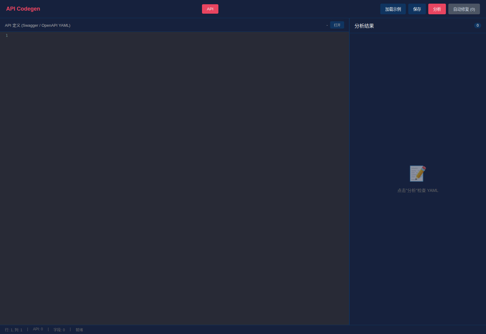

**2. Swagger 2.0 示例载入** - 直接展示当前原始 YAML 工作区


**3. 点击加载示例后** - 示例会直接写入左侧原始 YAML 编辑器
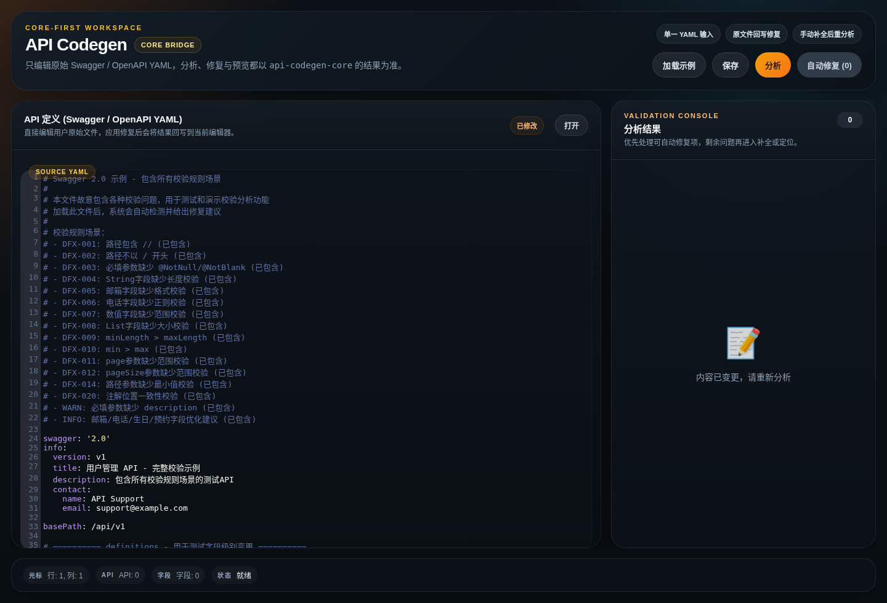

**4. Swagger 2.0 示例已加载** - 左侧只编辑用户原始 YAML
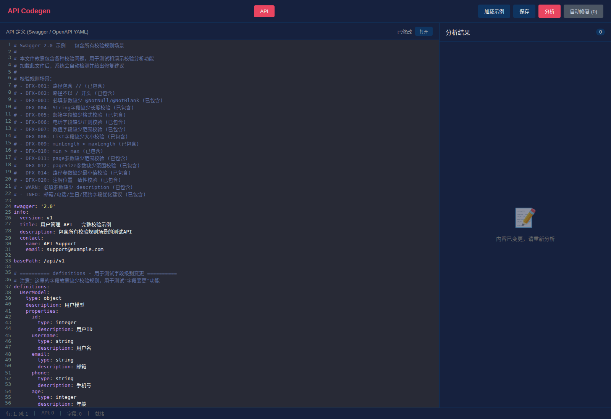

**5. Swagger 分析结果** - 右侧验证面板展示问题总览
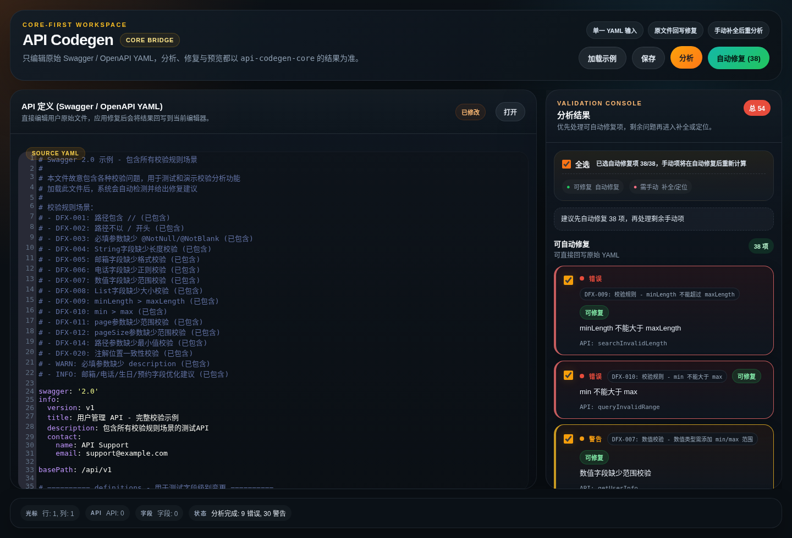

**6. 详细校验结果** - 优先展示当前可自动修复项


**7. 自动修复预览** - Monaco 双栏对比原始 YAML 与修复后 YAML
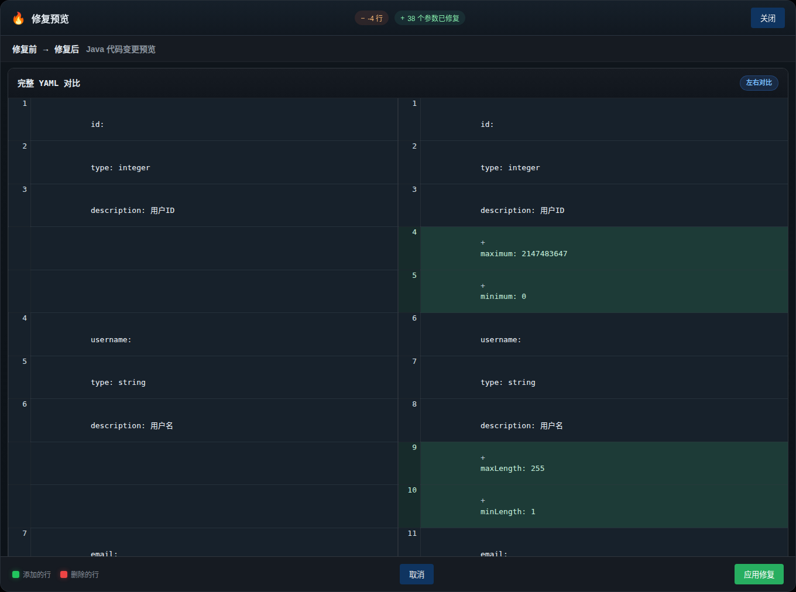

**8. 自动修复后的手动处理组** - 同字段关联问题归并为一个补全入口
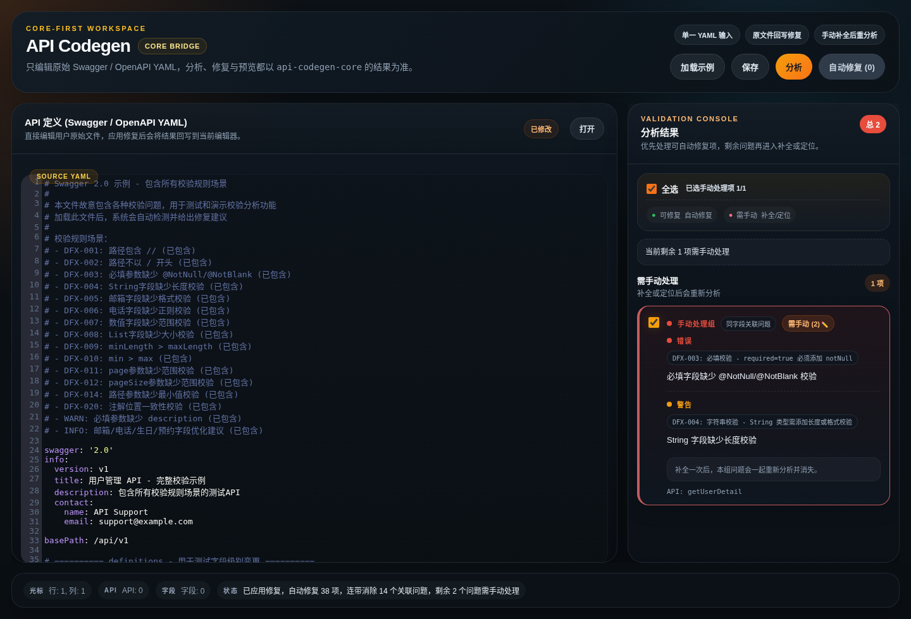

**9. OpenAPI 3.0 示例载入** - 与 Swagger 共用同一套编辑工作区
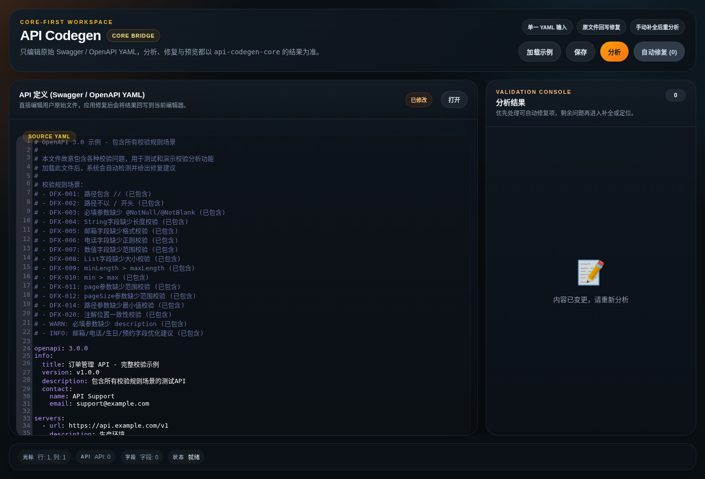

**10. OpenAPI 3.0 初始视图** - 输入文件仍然只保留一份原始 YAML


**11. OpenAPI 3.0 分析结果** - 与 Swagger 共用同一套 core 分析/修复能力
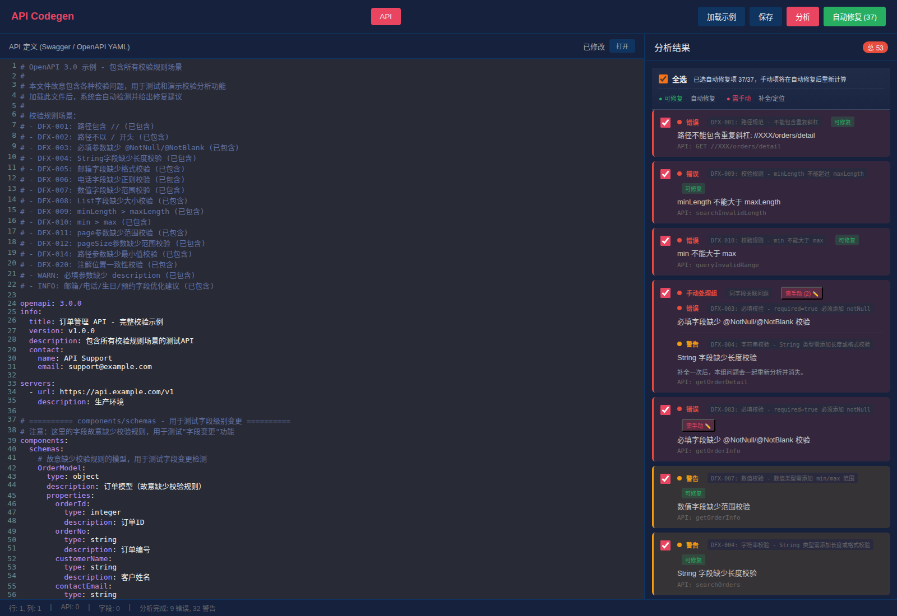

**12. 路径错误示例** - 路径重复斜杠和缺少前导 `/` 的原始输入
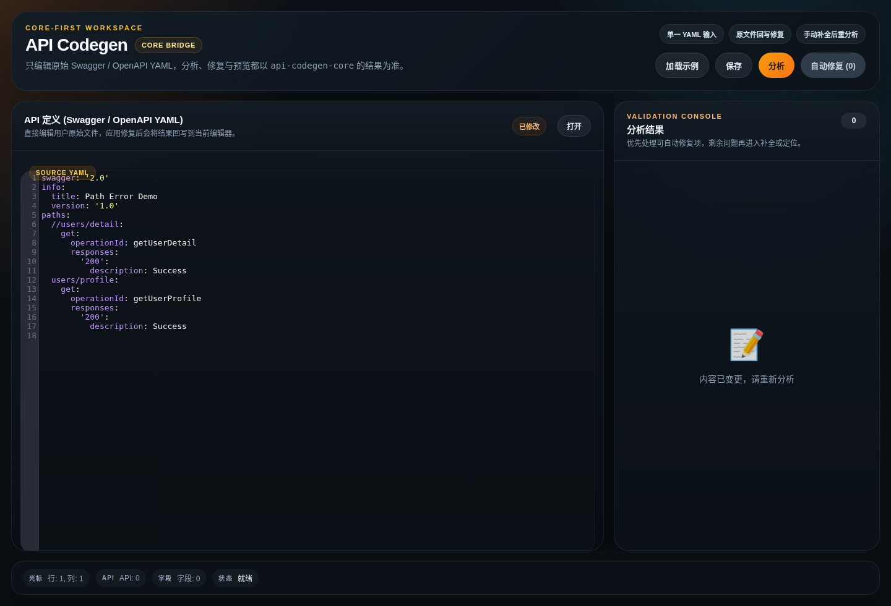

**13. 路径错误分析结果** - 自动修复项与需手动项会拆开展示
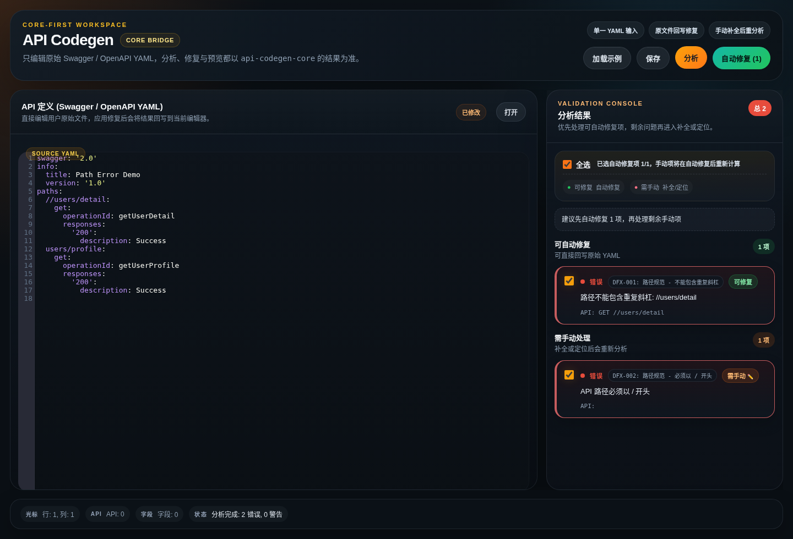

### Web UI 与 Core 的关系

| Web UI 操作 | 实际执行 |
|------------|----------|
| 打开 / 粘贴 YAML | 编辑用户原始 Swagger / OpenAPI 文件 |
| 点击“分析” | 调用 `api-codegen-core` 的统一分析入口 |
| 点击“自动修复” | 由 `api-codegen-core` 计算可安全回写的修复 |
| 查看修复预览 | 对比原始 YAML 与修复后的 YAML |
| 点击“应用修复” | 将修复结果写回编辑器并重新分析 |
| 点击“需手动” | 在缺少类型语义时补全必要信息，再重新分析 |

### IntelliJ 插件（可选）

项目还提供独立的 IntelliJ IDEA 插件，可在 IDE 中直接使用。

**注意**：IntelliJ 插件位于独立仓库：`https://github.com/Emtemf/api-codegen-intellij-standalone`

### Maven 插件

适用场景：

- 你已经有一份 Swagger / OpenAPI YAML，希望在 Maven 构建阶段直接生成 Controller、Request、Response 代码
- 你希望把分析、自动修复、代码生成接入本地构建或 CI

最小生成命令：

```bash
mvn com.apicgen:api-codegen-maven-plugin:generate \
  -DyamlFile=src/main/resources/api.yaml \
  -DbasePackage=com.example.demo
```

执行效果：

- 读取 `yamlFile` 指向的 API 定义
- 先做解析与校验，再生成统一 Controller 和对应的 Request / Response 类
- 默认输出根目录是 `${basedir}/src/main/java`，再拼接 controller / request / response 子路径
- 当前默认子路径分别是 `generated/api/`、`src/main/java/req/`、`src/main/java/rsp/`

### Java 直接运行

```bash
# 先构建项目（使用 Maven Wrapper，无需安装 Maven）
./mvnw clean install -DskipTests

# 或使用本地 Maven
mvn clean install -DskipTests

# 使用 Maven 执行插件运行
cd api-codegen-core
../mvnw exec:java -Dexec.mainClass="com.apicgen.Main" -Dexec.args="api.yaml"
```

## 单文件输入与自定义注解

用户只维护一份 API YAML。
如果需要给生成的 Controller 类或方法附加自定义注解，直接写在 Swagger / OpenAPI 文件里即可。

含义：

- `x-java-class-annotations` 写在 path 层，作用到生成的 Controller 类
- `x-java-method-annotations` 写在具体 HTTP 方法层，作用到对应生成的方法

Swagger 2.0 写法：

```yaml
swagger: "2.0"
info:
  title: User API
  version: "1.0"
paths:
  /users:
    x-java-class-annotations:
      - "@Secured"
      - "@AuditLog(action='USER_QUERY')"
    post:
      operationId: createUser
      x-java-method-annotations:
        - "@Permission('user:create')"
        - "@AuditLog(action='CREATE_USER')"
      responses:
        "200":
          description: OK
```

OpenAPI 3.0 写法：

```yaml
openapi: 3.0.1
info:
  title: User API
  version: "1.0"
paths:
  /users:
    x-java-class-annotations:
      - "@Secured"
      - "@AuditLog(action='USER_QUERY')"
    post:
      operationId: createUser
      x-java-method-annotations:
        - "@Permission('user:create')"
        - "@AuditLog(action='CREATE_USER')"
      responses:
        "200":
          description: OK
```

生成命令示例：

```bash
mvn com.apicgen:api-codegen-maven-plugin:generate \
  -DyamlFile=api.yaml \
  -DbasePackage=com.example.user \
  -DoutputDir=./out
```

实际输出路径：

- `./out/generated/api/com/example/user/api/UserApi.java`
- `./out/src/main/java/rsp/com/example/user/rsp/Response.java`

输入与实际生成结果：
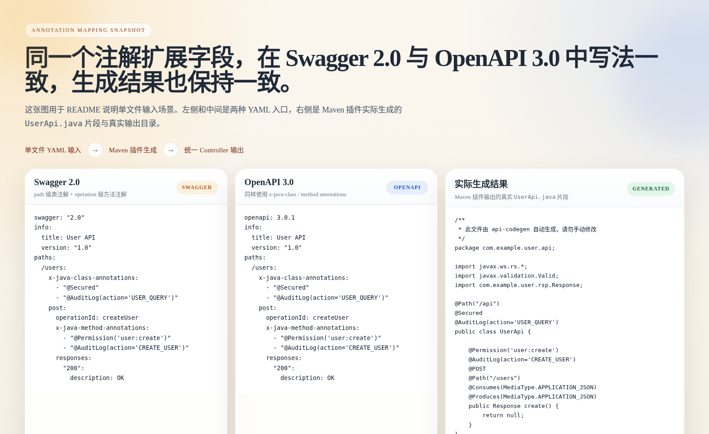

> 代码生成器同时支持 Spring MVC 和 JAX-RS (CXF) 注解，无需额外配置。

## Maven 插件常用参数

下面这些说明基于当前插件实现：

```bash
mvn com.apicgen:api-codegen-maven-plugin:generate [参数]
```

| 参数 | 作用 | 典型场景 |
|------|------|----------|
| `-DyamlFile=...` | 指定输入的 Swagger / OpenAPI 文件 | 你的 YAML 不在默认的 `src/main/resources/api.yaml` |
| `-DbasePackage=...` | 指定生成代码的基础包名 | 希望生成到你的业务包路径，而不是默认 `com.apicgen` |
| `-DoutputDir=...` | 指定代码输出根目录 | 想输出到自定义源码目录或临时生成目录 |
| `-Dframework=cxf` / `-Dframework=spring` | 选择生成哪套接口风格 | 项目使用 CXF 或 Spring MVC 时切换 |
| `-Dcompany=\"...\"` | 给生成文件拼接版权头 | 公司内部项目需要统一版权声明 |
| `-Dforce=true` | 目标文件已存在时先备份再覆盖 | 你确认要用新生成结果覆盖旧文件 |
| `-Danalyze=true` | 只分析，不生成代码 | 想在 CI 里先做规则校验 |
| `-DautoFix=true` | 自动修复 YAML 并回写，然后退出 | 想批量修复规则问题，不立即生成代码 |

补充说明：

- 默认 `force=false`，如果目标文件已存在，插件会跳过写入
- `force=true` 时，插件会先生成 `.bak` 备份，再覆盖原文件
- `autoFix=true` 时会直接回写 YAML，不继续进入代码生成
- Maven 插件默认不再隐式读取项目根目录的第二份配置文件

## 校验规则

系统会自动检测字段并添加校验规则：

### 路径规范

| 场景 | 规则 | DFX代码 |
|------|------|---------|
| 路径包含 `//` | 删除重复斜杠 | DFX-001 |
| 路径不以 `/` 开头 | 自动添加前缀 | DFX-002 |

### 参数校验

| 场景 | 规则 | DFX代码 |
|------|------|---------|
| 必填字段缺少 @NotNull | required=true | DFX-003 |
| String 必填使用 @NotBlank | required=true 且 type=String | DFX-003 |
| page/pageNum 分页参数 | min: 1, max: 2147483647 | DFX-011 |
| pageSize/limit/size | min: 1, max: 100 | DFX-012 |
| 路径参数（数值） | min: 1 | DFX-014 |
| 路径参数（字符串） | minLength: 1 | DFX-014 |

### 字段校验

| 场景 | 规则 | DFX代码 |
|------|------|---------|
| String 字段缺少长度校验 | minLength: 1, maxLength: 255 | DFX-004 |
| 邮箱字段缺少格式校验 | format: email | DFX-005 |
| 电话字段缺少正则校验 | 包含 phone/mobile | DFX-006 |
| 数值字段缺少范围 | Integer/Long/Double | DFX-007 |
| List 字段缺少大小 | minSize: 1, maxSize: 100 | DFX-008 |

### 校验规则

| 场景 | 规则 | DFX代码 |
|------|------|---------|
| minLength 超过 maxLength | 报错 | DFX-009 |
| min 超过 max | 报错 | DFX-010 |
| minSize 超过 maxSize | 报错 | DFX-011 |

### 接口规范

| 场景 | 规则 | DFX代码 |
|------|------|---------|
| 缺少 operationId | 自动生成 | DFX-012 |
| 缺少成功响应 2xx | 警告 | DFX-013 |
| 缺少 API 名称 | 报错 | DFX-015 |
| 缺少 API 路径 | 报错 | DFX-016 |
| 缺少 HTTP 方法 | 报错 | DFX-017 |

### YAML 语法

| 场景 | 规则 | DFX代码 |
|------|------|---------|
| 重复的键 | 报错 | DFX-018 |
| YAML 格式错误 | 报错 | DFX-019 |

### 支持的参数类型

代码生成支持以下参数类型注解：

| 参数位置 | 注解 | 说明 |
|----------|------|------|
| 路径参数 | `@PathParam` | URL 路径中的参数 |
| 查询参数 | `@QueryParam` | URL 查询字符串参数 |
| 请求头 | `@HeaderParam` | HTTP 请求头参数 |
| Cookie | `@CookieParam` | Cookie 参数 |
| 请求体 | `@RequestBody` | JSON 请求体 |

生成的 Controller 方法示例：

```java
@GET
@Path("/users/{id}")
@Produces(MediaType.APPLICATION_JSON)
public Response getUserById(
    @NotNull @Min(1) @PathParam("id") Integer id,
    @NotBlank @Size(min=1, max=255) @HeaderParam("X-Token") String xToken,
    @Size(min=1, max=64) @CookieParam("JSESSIONID") String jsessionid) {
    // TODO: 实现业务逻辑
    return null;
}
```

## 示例文件

- `swagger2-example.yaml` - Swagger 2.0 示例
- `openapi3-example.yaml` - OpenAPI 3.0 示例
- `web-ui/demo-swagger.html` - Web UI Swagger 示例
- `web-ui/demo-openapi.html` - Web UI OpenAPI 示例

## 测试

```bash
./mvnw test

# 仅运行 core 相关测试
./mvnw -pl api-codegen-core test

# Web UI bridge / diff / render 回归
cd web-ui && npm run test:ci

# Web UI E2E（Playwright）
cd web-ui && npm run test:e2e
```

### 测试要求

**核心原则：`api-codegen-core` 为单一业务来源**

所有分析、修复、格式收敛逻辑都必须在 `api-codegen-core` 实现。Web UI、IDEA 插件、浏览器插件和 Maven 插件只做交互、集成与展示。

**BDD 格式**：所有测试使用 Given-When-Then 结构，确保可读性。

**覆盖率要求**：
- 所有场景覆盖（每个 DFX 规则都有测试）
- 所有分支覆盖（if/else 都要覆盖 true/false）
- 边界条件覆盖（min/max 边界值）
- 正向+反向测试（合法和非法输入）

**重要**：不根据参数名推断类型，保留用户原始定义。

### 端到端测试场景

```bash
# Web UI bridge / diff / render 回归
cd web-ui && npm test

# E2E 测试
cd web-ui && npm run test:e2e
```

**测试覆盖的 DFX 规则**：

| DFX 规则 | 测试场景 |
|----------|---------|
| **路径规范** |
| DFX-001 | 路径包含 `//` → 自动删除重复斜杠 |
| DFX-002 | 路径不以 `/` 开头 → 自动添加前缀 |
| **参数校验** |
| DFX-003 | 必填参数缺少 `@NotNull` → 自动添加 |
| DFX-011 | page 参数缺少范围 → 自动添加 `min:1, max:2147483647` |
| DFX-012 | pageSize 参数缺少范围 → 自动添加 `min:1, max:100` |
| DFX-014 | 路径参数缺少校验 → 自动添加 `min:1` 或 `minLength:1` |
| **字段校验** |
| DFX-004 | String 字段缺少长度校验 → 自动添加 `@Size` |
| DFX-005 | email 字段缺少格式校验 → 自动添加 `@Email` |
| DFX-006 | phone 字段缺少正则校验 → 自动添加 pattern |
| DFX-007 | 数值字段缺少范围校验 → 自动添加 `@Min`/`@Max` |
| DFX-008 | List 字段缺少大小校验 → 自动添加 `@Size` |

**架构分层**：

```
┌─────────────────────────────────────┐
│ Web UI / IDEA 插件 / 浏览器插件      │
└──────────────┬──────────────────────┘
               │ bridge contract / 调用
┌──────────────▼──────────────────────┐
│       api-codegen-core (核心库)      │ ← 校验 / 修复 / 转换 / 生成
└──────────────┬──────────────────────┘
               │ 集成
┌──────────────▼──────────────────────┐
│      Maven 插件 / CLI / 其他宿主      │
└─────────────────────────────────────┘
```

## License

Apache-2.0
